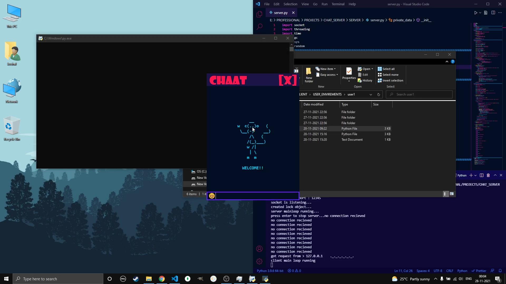
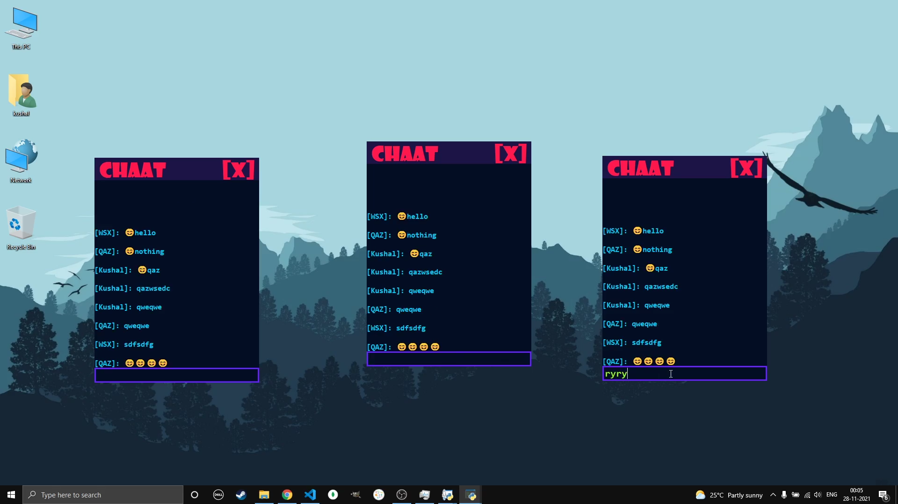
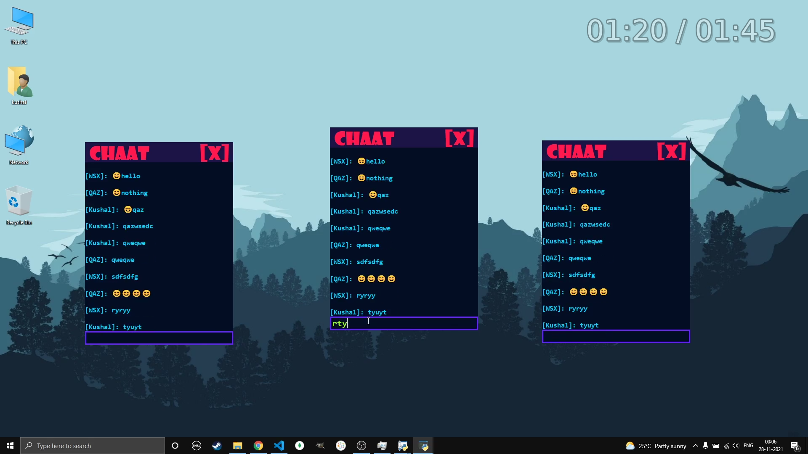

# CHAT-SERVER

* A communication application for people on the same network.

* [Video Demonstration](https://drive.google.com/file/d/1dHaEzF3raNYrsTjyzLcdFbh8ssGbpE2F/view?usp=sharing)

* A communication application for people on same network.

* It uses the _**sockets**_ for data interchange between computers to send messages to other computer in the chat room.

* A initial prototype of [CYPHER_PROTOCOL-P-Y-R-O-B-O-T](https://github.com/P-Y-R-O-B-O-T/CYPHER_PROTOCOL) was used to implement the network interfacing feature. This prototype was also multi threaded so that the information exchange have the minimal delay in posting the message.

* It also had the feature that _**reconnected the client to the server if the connection was lost in between**_.

* The UI is made very compact and clean to have minimum complexicity using the application.

* This can be great tool co communicate friends in a local newwork for any purpose.
